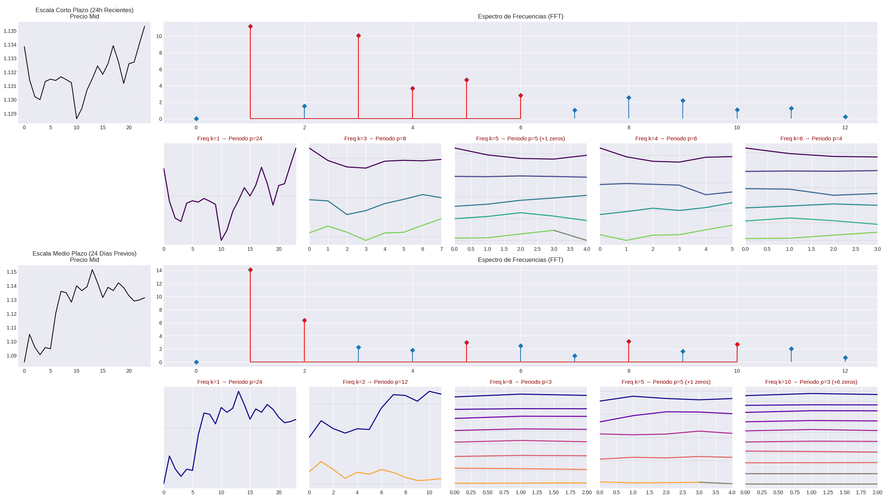
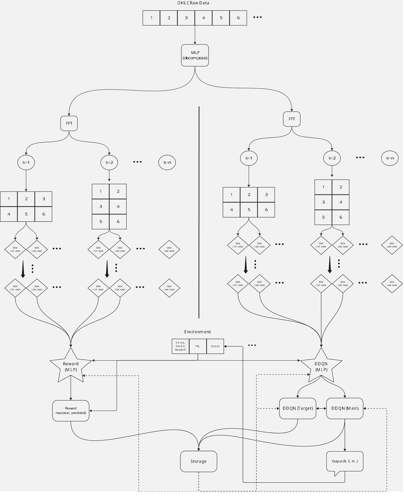

# 1. Resumen del Proyecto

Este proyecto sigue los pasos del anterior, moviendo el paradigma desde la minería de Alphas estadística hacia el **Aprendizaje por Refuerzo Profundo (Deep RL)**. El desafío central es la "Eficiencia del Mercado": en un entorno con spreads, comisiones y swaps, la señal predictiva debe ser lo suficientemente fuerte como para superar los costes de fricción.

## El core:

### TimesNet: Extracción Espectral en 2D
A diferencia de las arquitecturas lineales (RNN/LSTM), TimesNet descompone la serie temporal 1D en variaciones 2D basadas en periodicidades detectadas por **FFT (Fast Fourier Transform)**. 
- El modelo identifica los periodos dominantes y "apila" la serie en mapas 2D.
- Esto permite que los **Inception Blocks** capturen patrones cíclicos (intra-periodo e inter-periodo) que son invisibles para modelos tradicionales.

### Arquitectura SRDDQN (The Two-Headed Monster)
Para resolver la "recompensa dispersa" del trading, se implementó un cabezal dual:
1.  **Q-Head (Actor):** Decide la ejecución (Buy, Sell, Neutral).
2.  **Reward-Head (Oracle Predictor):** Aprende a predecir el "Expert Reward" (el retorno máximo teórico a 24h). 

Durante el entrenamiento, el agente utiliza una **Recompensa Híbrida** para estabilizar el gradiente, permitiendo que el modelo aprenda qué es una "oportunidad ideal" incluso antes de ser capaz de ejecutarla rentablemente.

## Evaluación y Realidad Cruda

Para este proyecto, el Score final fue **0.0000**. 
$$Score = \max(0, Sortino) \times \max(0, Calmar)$$
Los resultados muestran que, aunque el modelo reduce la pérdida (`Loss`), la política de trading no logra superar el **Buy & Hold**. Esto confirma que en el EURUSD, los costes operativos (0.7 pips + Swaps) actúan como una barrera de entrada que requiere precisión para ser rentable.

# 2. Requisitos, Ejecución y Artefactos

## Datos necesarios (inputs)
Para la ejecución completa del pipeline se requieren los siguientes archivos en `/content/`:
- **Datos Horarios:** `EURUSD_Candlestick_1_Hour_ASK_22.03.2006-30.08.2025.csv` y su contraparte `BID`.
- **Datos Diarios:** `EURUSD_Candlestick_1_D_ASK_22.03.2006-30.08.2025.csv` y su contraparte `BID`.
- **Librería de Alphas:** `all_raw_new.csv` y `all_raw_old.csv` (generados en el Proyecto 2).

## Artefactos generados (outputs)
El pipeline genera automáticamente los siguientes archivos de datos procesados:
- `EURUSD_Precomputed_Tested.csv`: Dataset con sincronización horaria-diaria y test de integridad (Look-ahead bias check).
- `EURUSD_Final_Dataset_RL.csv`: Dataset base con la recompensa para el entrenamiento de RL.
- `EURUSD_Final_Dataset_RL_With_All_Alphas.csv`: Versión final enriquecida con los indicadores técnicos de mayor relevancia estadística.

# 3. Experimentos y Auditoría de Resultados

Antes de la conclusión, se analizaron los dos paradigmas de entrenamiento:

## Experimento A: Precios Crudos (Z-Score)
El modelo aprendió a minimizar el riesgo (Early Stopping en Ep 80), pero la curva de equity mostró una degradación constante. El agente tendió a una política "conservadora negativa", donde el coste del swap y el spread erosionaron el capital inicial.

## Experimento B: Inyección de Alphas Estadísticos
Se inyectaron indicadores del Proyecto 2 para dar "contexto" al agente. Aunque la pérdida (`Loss`) fue más estable, el modelo final obtuvo un **Retorno Negativo** en validación.

### Diagnóstico de Fallo:
Al contrastar estos resultados con el [Paper original (TimesNet/SRDDQN)](https://www.mdpi.com/2227-7390/12/24/4020), que reporta métricas excepcionales (Sharpe > 3, rendimientos > 1000%), se identificaron discrepancias críticas que explican la brecha de rendimiento:

1.  **Sesgo de Evaluación (Overfitting por Split):** Muchos modelos académicos utilizan un único split simple de *Train-Test*. Al implementar un esquema de validación más riguroso (Train-Val-Test) y con una ventana temporal de 20 años, se observa que la generalización es el verdadero cuello de botella.
2.  **Subestimación de la Fricción:** Los entornos reales de corretaje (comisiones, spreads y el impacto del **Triple Swap**) erosionan rápidamente los beneficios de las micro-tendencias detectadas por la FFT.

# 4. Conclusiones y Futuro

El proyecto demuestra que la arquitectura **TimesNet** es capaz de procesar la complejidad espectral del mercado, pero la política de decisión requiere un mecanismo de adaptación más dinámico para sobrevivir a los costes de ejecución.

## Próximos pasos (Hacia la rentabilidad):

1.  **Expansión Multi-Activo:** Evolucionar a una arquitectura multivariante que integre correlaciones entre divisas (e.g., USD Index) para compensar la falta de señal en un solo par.
2.  **Transición a Vision Transformers (ViT):** Sustituir el backbone de CNN por **ViTs** sobre las representaciones 2D generadas por FFT para capturar dependencias globales de largo alcance.
3.  **Regime-Based Curriculum Learning:** Entrenar al agente exclusivamente en regímenes de alta volatilidad primero, donde la señal supera claramente al spread.
4.  **Optimización Bayesiana (Optuna):** Ajuste fino sistemático de la ventana de look-ahead ($m$) y la tasa de descuento ($\gamma$).
5.  **Adaptación Incremental (DoubleAdapt):** Integrar meta-aprendizaje para mitigar el *concept drift*. Esto permitiría al agente adaptar sus pesos dinámicamente ante cambios en la distribución de los retornos (ver [DoubleAdapt Paper](https://arxiv.org/pdf/2306.09862)).
